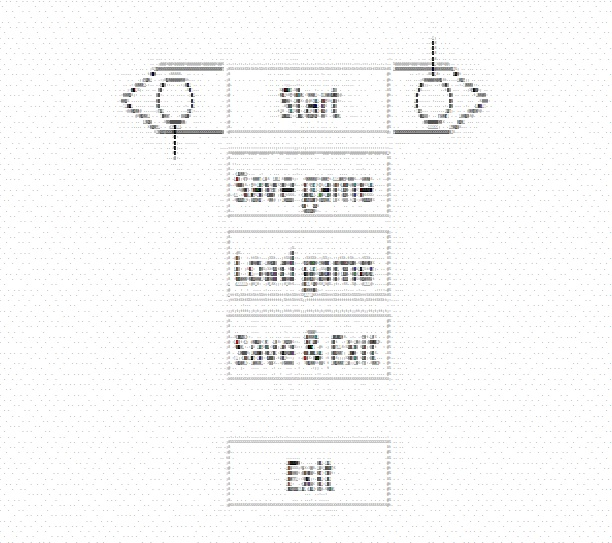

# Концепт игры “Фрегат”

## Contents

1. [Chapter I](#chapter-i) \
    1.1. [Readme!](#readme)\
    1.2. [Level 1. StartMenu.](#level-1-room-1)\
    1.3. [Level 1. Intro.](#level-1-room-1)\
    1.4. [Level 1. StartMenu.](#level-1-room-1)\
2. [Chapter II](#chapter-i) \
    2.1. [Level 2. Room 1.](#level-2-room-1)\
3. [Chapter II](#chapter-i) \
    3.1. [Level 3. Room 1.](#level-3-room-1)\

## Chapter I

## Readme!

\>
От разработчиков: \
Здравствуй, дорогой друг! \

Концепт уже в ASCII, т.е. принципиально реализуемой графики.

## Level 1. Room 1.

## Level 1. Intro.

## Chapter II

## Level 2. Room 1.

>Не работайте в develop, пользуйтесь приведённой ниже схемой: 
>

