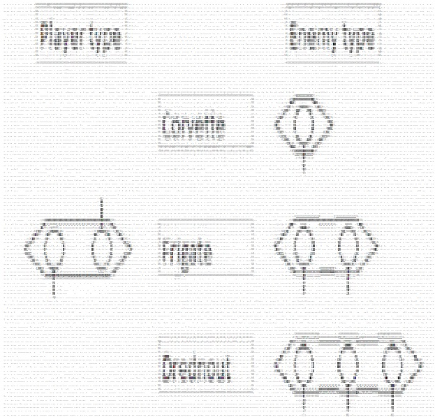
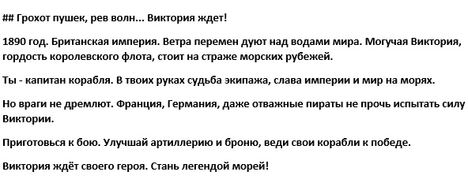
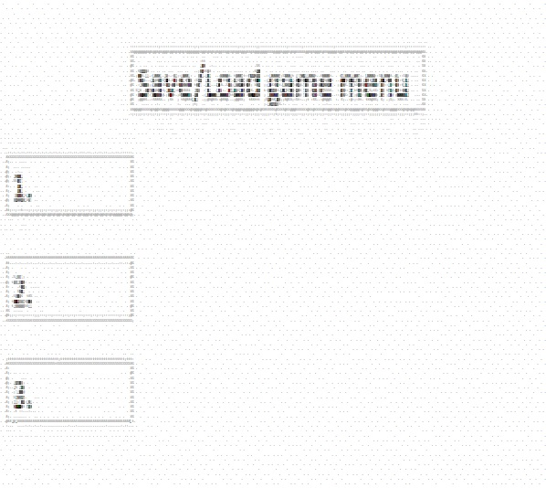
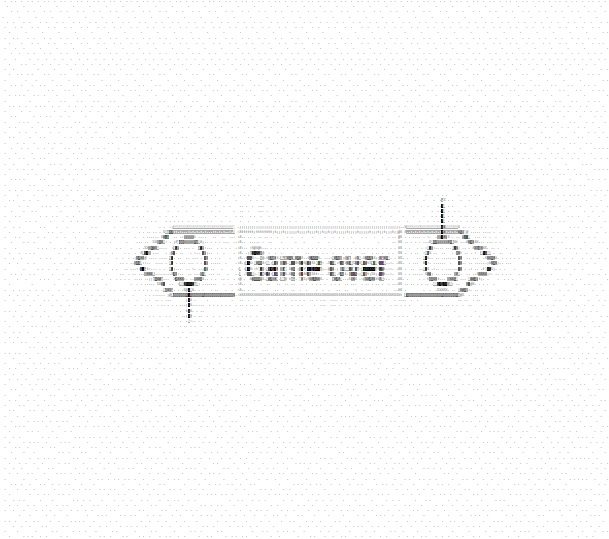
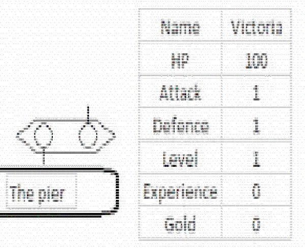
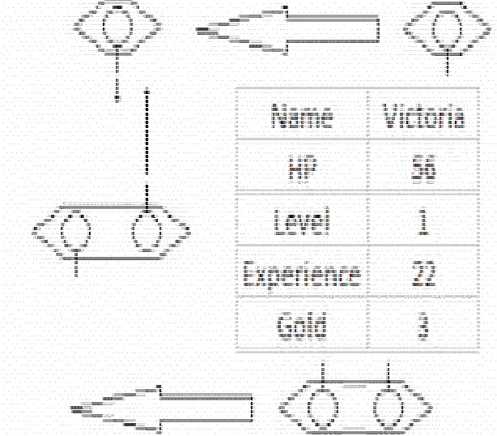
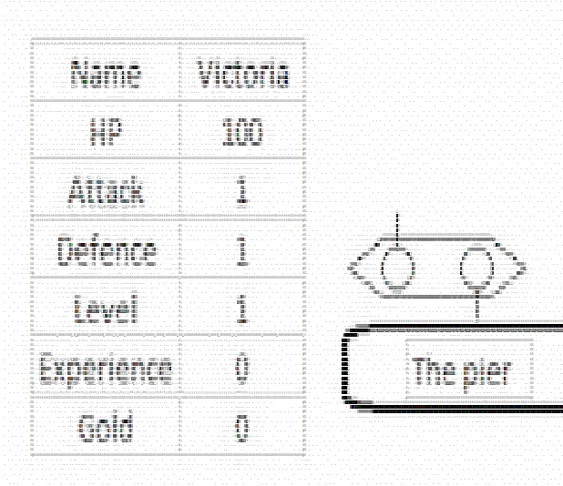

# Концепт игры “Фрегат”

## Contents

1. [Chapter I Menu.](#chapter-i) \
    1.1. [Readme!](#readme)\
    1.2. [Level 1. StartMenu.](#level-1-room-1)\
    1.3. [Level 1. Intro.](#level-1-room-1)\
    1.4. [Level 1. SaveLoad.](#level-1-room-2)
    1.5. [Level 1. GameOver.](#level-1-room-3)
2. [Chapter II. Gameplay](#chapter-i) \
    2.2. [Level 2. Start.](#level-2-room-1)\
    2.2. [Level 2. Gameplay.](#level-2-room-2)\
    2.3. [Level 2. Finish.](#level-2-room-3)\
3. [Chapter II](#chapter-i) \
    3.1. [Level 3.Resume.](#level-3-room-1)

## Chapter I

## Level 1.1. Readme!

\>
От разработчиков: \
Здравствуй, дорогой друг! \

Концепт уже в ASCII, т.е. принципиально реализуемой графики.

Пример концепта:

## Level 1.2 StartMenu.

## Level 1.3 Intro.

## Level 1.4 SaveLoad.

## Level 1.5 GameOver.

## Chapter II

## Level 2.1 Start.

## Level 2.2 Gameplay.

## Level 2.3 Finish.

## Chapter III

## Level 3.1 Resume.

\> В принципе никакой видимой проблемы в кодировке и взаимосвязях нет, надо пробовать реализовать.

